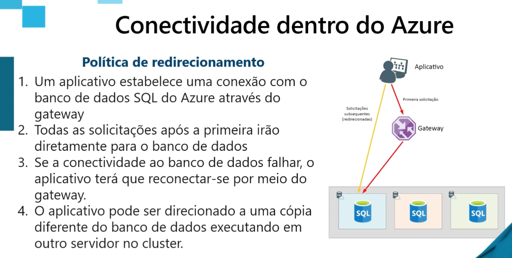

# DP-900 - Módulo 7

## Conectividade dentro do azure

- Público ou privado

## Autenticação

- Usuário admin
- Usuário do Activity Directory
- Logons SQL

## Controle de acesso

- RBAC(Controle baseado em função)

## Réplicas de leitura

- Acesso somente de leitura em uma segunda região
